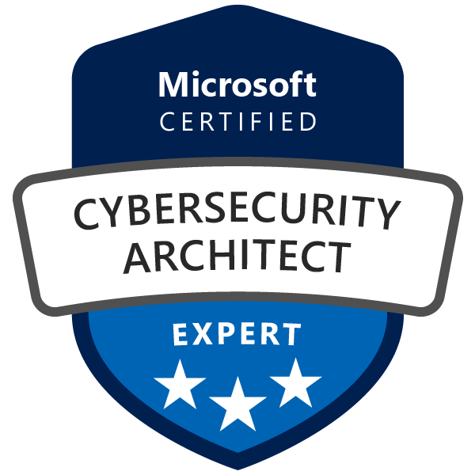

## About me

Reliable IT Engineer with over 17 years of experience managing on-premise and cloud-based infrastructure and solutions with a security-minded focus. Skilled in applying DevOps principles and agile methodologies to deliver high-quality products and services in a fast-paced and collaborative environment. Progressive experience in the field marked by continuous contributions above and beyond requirements. Experienced in using various tools and technologies to automate, monitor, and optimize the development and deployment processes. Meticulous attention to detail with deep technical knowledge. Adept at working with cross-functional teams and communicating effectively with stakeholders, demonstrating resiliency even in challenging situations. Always seeking untapped potential for growth and innovation.

## Licenses & certifications

&nbsp;&nbsp;&nbsp;&nbsp;&nbsp;&nbsp;&nbsp;&nbsp;&nbsp;&nbsp;&nbsp;&nbsp;&nbsp;&nbsp;&nbsp;

&nbsp;&nbsp;&nbsp;&nbsp;&nbsp;&nbsp;&nbsp;&nbsp;&nbsp;&nbsp;&nbsp;&nbsp;&nbsp;&nbsp;&nbsp;

<!-- 

 -->

## Support

&nbsp;&nbsp;&nbsp;

